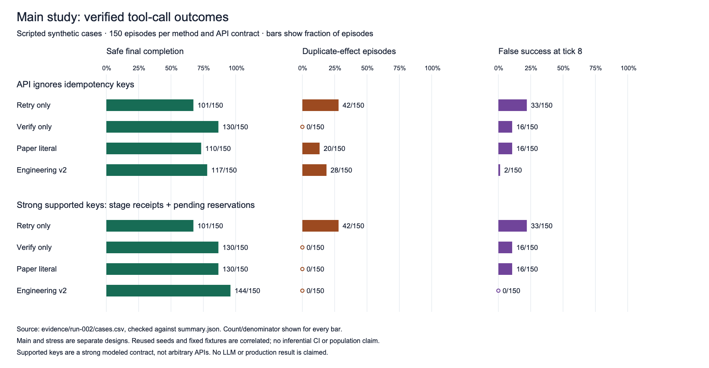
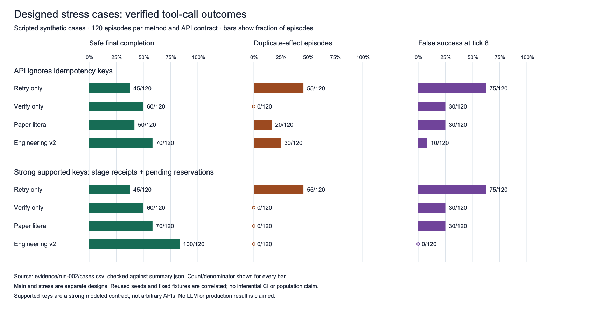

# Measured result graphs

These original figures plot the frozen engineering-v2 evaluation in [`evidence/run-002`](../../evidence/run-002). Each bar starts at zero and displays its exact numerator and denominator. [Source data](result-graph-data.csv), [generation code](../../scripts/render_result_graphs.py), [PNG renderer](../../scripts/render_result_png.swift), and [input/output hashes](RESULT_GRAPH_MANIFEST.json) are included. The generator independently recounts all 2,160 raw cases and checks the accepted `summary.json` before writing figures. It does not rerun the experiment.

Safe final completion means full required state and exactly one append effect at logical tick 8. A duplicate-effect episode has at least one extra committed append. False success means the wrapper reported success but safe final completion was false. Every numerator is divided by **all episodes in that method/profile group**, including false-success counts; it is not conditioned on reported successes. The profiles mean **API ignores idempotency keys** and **strong modeled support with durable stage receipts plus pending reservations**. Retry-only and verify-only baselines omit keys, so their results repeat across profiles.

## Main study



[SVG](main-results.svg) · [PNG](main-results.png)

**Caption.** Each method/profile row covers 150 scripted fixtures: two tasks, three fault levels and 25 reused seed streams. With keys ignored, verify-only has 130/150 safe completions versus engineering v2's 117/150, while engineering has 28/150 duplicate episodes. With the strong keyed contract, engineering reaches 144/150 safe completions and 0/150 duplicates or false successes; paper-literal still has 16/150 false successes despite 0/150 duplicates. These are local fixture outcomes, not a universal method ranking.

**Alt text.** Three aligned panels show safe final completion (green), duplicate-effect episodes (rust), and false success at tick 8 (purple). Two row blocks compare APIs that ignore keys with strong supported keys. Four methods appear in each block: retry-only, verify-only, paper-literal and engineering v2. The exact values follow.

| API contract | Method | Safe final | Duplicate episodes | False success |
|---|---|---:|---:|---:|
| Ignores keys | Retry only | 101/150 | 42/150 | 33/150 |
| Ignores keys | Verify only | 130/150 | 0/150 | 16/150 |
| Ignores keys | Paper literal | 110/150 | 20/150 | 16/150 |
| Ignores keys | Engineering v2 | 117/150 | 28/150 | 2/150 |
| Strong supported keys | Retry only | 101/150 | 42/150 | 33/150 |
| Strong supported keys | Verify only | 130/150 | 0/150 | 16/150 |
| Strong supported keys | Paper literal | 130/150 | 0/150 | 16/150 |
| Strong supported keys | Engineering v2 | 144/150 | 0/150 | 0/150 |

## Designed stress cases



[SVG](stress-results.svg) · [PNG](stress-results.png)

**Caption.** Each method/profile row covers 120 deliberately weighted cases: two tasks, 12 prescribed schedules and five payload fixtures. Under ignored keys, engineering v2 has 70/120 safe completions, 30/120 duplicate episodes and 10/120 false successes. Under strong supported keys, those counts become 100/120, 0/120 and 0/120. Retry-only still reports 75/120 false successes in both profiles because it uses no key. Equal schedule weights are stress coverage, not real incident frequencies.

**Alt text.** The main-study layout is repeated for designed stress cases: safe completion in green, duplicate episodes in rust, and false success in purple. The strong keyed contract removes duplicate episodes for paper-literal and engineering v2, but not all false successes for paper-literal. The exact values follow.

| API contract | Method | Safe final | Duplicate episodes | False success |
|---|---|---:|---:|---:|
| Ignores keys | Retry only | 45/120 | 55/120 | 75/120 |
| Ignores keys | Verify only | 60/120 | 0/120 | 30/120 |
| Ignores keys | Paper literal | 50/120 | 20/120 | 30/120 |
| Ignores keys | Engineering v2 | 70/120 | 30/120 | 10/120 |
| Strong supported keys | Retry only | 45/120 | 55/120 | 75/120 |
| Strong supported keys | Verify only | 60/120 | 0/120 | 30/120 |
| Strong supported keys | Paper literal | 70/120 | 0/120 | 30/120 |
| Strong supported keys | Engineering v2 | 100/120 | 0/120 | 0/120 |

## Reading and reproducing these figures

The same fixture/seed streams are compared across methods and profiles. Main rows reuse 25 seeds across tasks and fault levels; stress rows reuse five payload fixtures across prescribed schedules. Episodes are coupled, not independent population draws. The bars have no inferential confidence intervals, and differences do not establish significance, production reliability or the paper's Gemini/LangGraph percentages. The fixed synthetic API contracts, settling horizon and case weights limit generalization; see [limitations](../../docs/LIMITATIONS.md) and [full results](../../docs/RESULTS.md).

From the repository root, generate into a **new directory** to preserve the checked-in images:

```sh
python3 scripts/render_result_graphs.py --out /private/tmp/vtc-graphs-repro
SWIFT_MODULECACHE_PATH=/private/tmp/vtc-swift-cache CLANG_MODULE_CACHE_PATH=/private/tmp/vtc-clang-cache swift scripts/render_result_png.swift /private/tmp/vtc-graphs-repro/main-results.svg /private/tmp/vtc-graphs-repro/main-results.png
SWIFT_MODULECACHE_PATH=/private/tmp/vtc-swift-cache CLANG_MODULE_CACHE_PATH=/private/tmp/vtc-clang-cache swift scripts/render_result_png.swift /private/tmp/vtc-graphs-repro/stress-results.svg /private/tmp/vtc-graphs-repro/stress-results.png
```

The SVGs and CSV require Python's standard library only. The 1700 × 885 PNGs were rendered from sanitized SVGs with macOS AppKit and visually inspected at full size. The manifest records SHA-256 receipts for the accepted inputs, CSV, SVGs, PNGs and both generator sources. PNG bytes may vary with the macOS renderer version; the source counts and SVGs are the portable comparison points. No Mermaid, browser renderer or third-party package was run for these figures.
