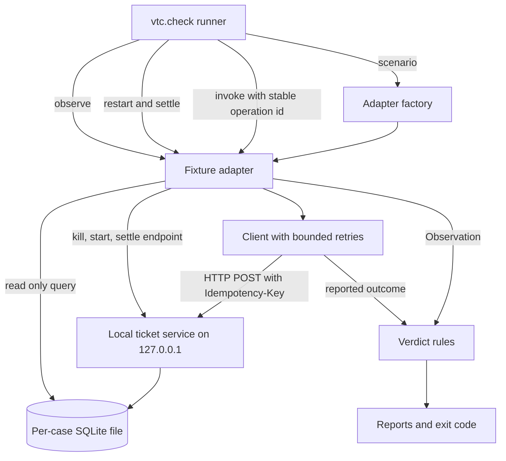
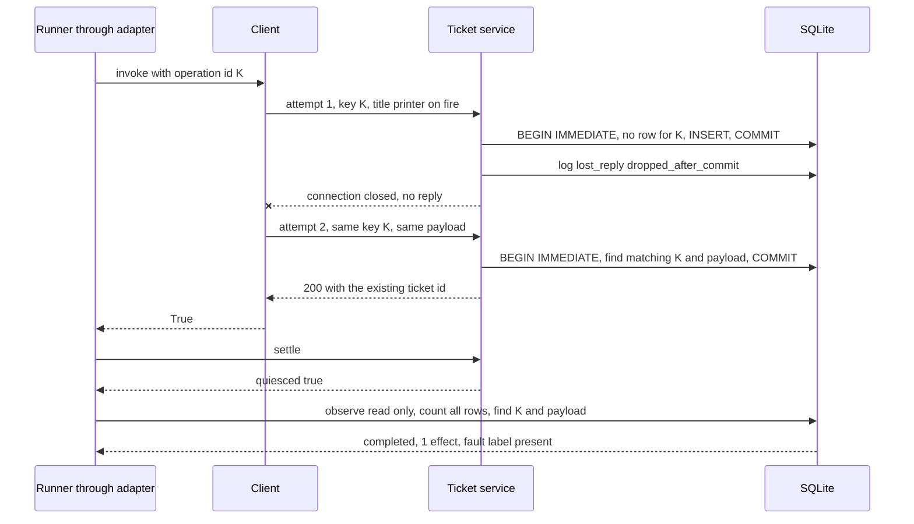
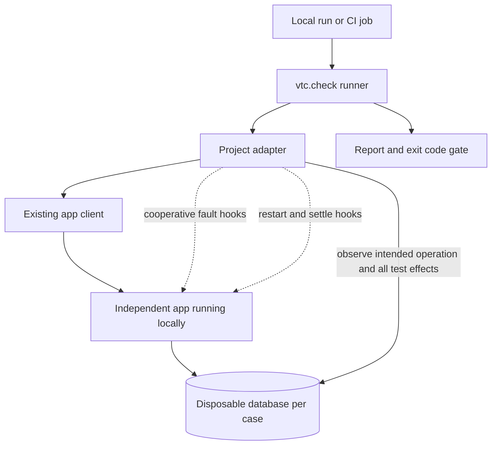

# Test Your App’s Retries Before They Create Duplicate Work

*A local HTTP and SQLite check for the moment a write commits and its reply disappears*

A support agent clicks Create ticket because a printer has stopped working. The app sends one POST request. The ticket service opens a transaction, inserts the row and commits. Then the connection closes before any reply reaches the app. To the app, the request failed. To the database, the work is done. The retry logic does what it was configured to do and sends the request again.

Whether the queue now holds one ticket or two was decided long before that click. It depends on whether the retry reuses the same operation key, whether the service checks that key inside the same transaction as the insert, and whether anyone ever tested a commit that succeeds while its reply vanishes.

This article follows that one ticket from the first attempt to the final database count. The research starting point is [Verified Tool Calls Improve LLM Agent Reliability Under Non-Atomic Failures, arXiv 2608.02645v1](https://arxiv.org/abs/2608.02645v1). I built a proof of concept based on the paper, and the code is in [Verified Tool Calls Lab](https://github.com/gael55x/verified-tool-calls-lab). The repository holds two separate pieces of work. One is my original simulator study of 2,160 scripted episodes. The other is a practical checker, `vtc.check`, which drives a real HTTP client against a real local service that stores tickets in SQLite. They answer different questions, so I keep their evidence apart.

The useful question is whether a retry change leaves one correct record. Here is how to test that, read the evidence and connect the checker to a different application.

## 1. The paper's question and my narrower one

The paper studies AI agents calling external tools when work takes effect but its reply is ambiguous. It evaluates checking the resulting state before retrying, and acknowledges that a delayed write can still land after a check.

My simulator replaces the agent with scripted policies and matched faults. The practical checker is a separate extension. It tests whether repeated attempts leave one correct effect, using your client’s retry behavior rather than the paper’s agent loop. Neither experiment reproduces the paper’s language-model results.

## 2. How the checker is put together



*Figure 1. The current vtc.check architecture as implemented. The runner owns the scenario and the operation ID, the client owns its retries, and the verdict compares the final database state with what the client reported.*


Each scenario starts a fresh child service and SQLite database. The fixture binds to a local port and strips inherited tokens and proxy settings from the server’s environment. A fresh operation ID stays constant throughout that case.

The adapter is the boundary between the generic runner and one specific system, and its contract has four methods. `invoke(operation_id)` makes one logical call and returns True only if the caller saw success. `restart()` kills the service and starts it again on the same storage. `settle()` releases held work, waits until nothing is in flight and returns True only once the service is quiet. `observe(operation_id)` reports completion, the effect count and the fault labels the service recorded.

The runner invokes the client, and the client performs retries. One invocation can therefore produce up to three HTTP requests in the bundled example. `--client MODULE:FUNCTION` replaces that client against the same fixture. `--adapter MODULE:FACTORY` connects a different service through hooks you supply.

Those modules are trusted local code. Only the fixture server gets the stripped environment; custom adapters inherit the checker’s environment and are not sandboxed. The CLI bounds the run with a process deadline and cleans up its owned process group on Linux or macOS. It cannot stop remote services or deliberately detached processes.

## 3. Following the ticket through a lost reply



*Figure 2. The lost reply scenario against the durable profile. The first commit stands even though the connection closes, and the retry replays the stored ticket instead of inserting a second one.*


The fault is injected where it hurts most. The service commits the first ticket, writes the label `lost_reply:dropped_after_commit` to an audit table and closes the connection without a response. The client sees a dropped connection and retries with the same key and body. What happens next depends entirely on how the service writes.

In `vtc/http_example.py`, the durable writer begins a SQLite `BEGIN IMMEDIATE` transaction, looks for the key, then inserts only if it is absent. A `UNIQUE` constraint backs the check. A repeat with the same key and payload returns the original ticket. Reusing the key with a different payload returns 422. The implementation commits the result or rolls back on an exception.

The lookup and write belong in the same transaction. Separating them would let two requests both find no record before either inserts.

The broken profile shows the tempting alternative. It inserts on every request and remembers replies in an in-memory dictionary, but only after a reply has been written to the socket. When the reply is lost nothing is cached, so the retry inserts a second ticket. That cache also disappears on restart and does nothing for overlapping requests or a late first write.

After the client returns, the runner calls settle and only then observes. The observer opens the database read only and asks two separate questions. Completion means a row exists with the exact operation ID and the exact expected payload. The effect count covers every row in that case's database, not just rows carrying the expected key. Because each case has a disposable database, counting everything exposes a client that changes its key between attempts, which would otherwise look like two unrelated successes.

Late commit holds the first write until a retry commits, then releases it. Concurrent overlaps two invocations. Restart kills the service process, starts it on the same database and invokes the same ID again.

## 4. How a verdict is reached

The runner validates the adapter’s evidence, but depends on the adapter to report it honestly. Settle must return True, and the observation must be well formed, with a real boolean for completion, a non-negative integer count and only known fault labels. Anything else is inconclusive.

The rules then run in a fixed order and the first match wins. More than one effect is a duplicate violation. Otherwise, if any invocation reported success while the exact operation never completed, that is a phantom success violation. Only then does the runner ask whether the fault actually ran, and missing required labels make the case inconclusive. Next, any invocation that reported failure means retry handling was not confirmed, which is also inconclusive, as is any remaining disagreement between completion and the count. A pass therefore needs every invocation to report True, exact completion, exactly one effect and every required fault label.

The ordering is deliberate. Two effects for one logical operation are evidence of a bug even if a fault hook misbehaved, so duplicates are judged first. A missing label means the fault may never have happened, and a tidy database proves nothing in that case.

The CLI exits 0 when every scenario passes, 1 when any violation appears and 2 for invalid input or inconclusive results. If adapter cleanup fails after an otherwise passing scenario, that pass is downgraded to inconclusive, and a crash inside the harness exits 2 rather than masquerading as a violation.

## 5. Run it from a fresh clone

The checker needs only the standard library. From the repository root, create a parent folder for reports, then run the deliberately broken profile and the durable one. Each `--out` must name a new directory inside a folder that already exists, so a rerun never overwrites earlier evidence.

```sh
git clone https://github.com/gael55x/verified-tool-calls-lab
cd verified-tool-calls-lab
mkdir -p repro-output
python3 -m vtc.check --profile broken --out repro-output/retry-broken
echo $?    # 1, four violations
python3 -m vtc.check --profile durable --out repro-output/retry-durable
echo $?    # 0, five passes
```

Use Python 3.10 or later on Linux or macOS. Each run prints a scenario summary and writes JSON and Markdown reports. Inspect the caller’s reported outcome, final completion, effect count and fault labels together. A suggested fix is a starting point for investigation, not an automatic repair.

A custom client must speak the fixture’s ticket protocol, including its expected title `printer on fire`. This fixed payload is a test fixture, not a requirement for your real application. The complete [adapter contract](https://github.com/gael55x/verified-tool-calls-lab/blob/main/docs/RETRY_CHECK.md) documents how to test a different service.

## 6. What the reference run showed

| Scenario | Broken effects | Durable effects | Expected |
|---|---|---|---|
| Clean control | 1 | 1 | 1 |
| Reply lost after commit | 2 | 1 | 1 |
| First write commits late | 2 | 1 | 1 |
| Concurrent attempts | 2 | 1 | 1 |
| Process killed and restarted | 2 | 1 | 1 |

Both profiles pass the clean control. Under the same faults and client, the broken profile creates duplicates while the durable profile keeps one ticket.

These are deliberately seeded failures, not bugs discovered in another application or estimates of live incident frequency. The late-write case shows why inspection must wait. One visible ticket can become two when an earlier request finishes.

The retained reports in [evidence/retry-check-001](https://github.com/gael55x/verified-tool-calls-lab/tree/main/evidence/retry-check-001) were captured before the final patch to SIGTERM cleanup, and their manifest preserves the source hashes from that run, so they are not raw output of the final release. The final release is covered by CI, which runs 53 tests on Python 3.10 and 3.12, including cancellation regressions and both quickstarts. A [fresh reader replay](https://github.com/gael55x/verified-tool-calls-lab/tree/main/evidence/reader-replay-20261002) also reruns both profiles against the final implementation, with source hashes retained. The [results summary](https://github.com/gael55x/verified-tool-calls-lab/blob/main/docs/RETRY_RESULTS.md) and [quickstart](https://github.com/gael55x/verified-tool-calls-lab/blob/main/docs/RETRY_CHECK.md) explain each artifact.

## 7. What the original simulator still tells us

The simulator came first. It kept an action's effect, its response and its visible record separate, so a write could succeed while its reply timed out, or a read could return stale data. Scripted policies ran 1,200 main cases and 960 stress cases with matched faults across two three-stage jobs.


*Figure 3. Correct final records out of 150 simulated cases per approach in the original study. Longer bars are better. A case counts only when the job is complete with no extra copy after delayed work settles. These are scripted simulator outcomes, not live failure rates.*

Retrying blindly finished 101 cases correctly and checking without retrying finished 130. Checking and then retrying finished 144 when the simulated service had a strong contract, remembering completed stages and reserving jobs still in progress. Against a service that ignored the key, the same policy finished only 117, worse than verifying without retrying, because recovery attempts created extra records. The result motivates testing the server contract directly.

None of this is a live statistic, and since no language model was involved it does not replicate the paper's results. The stress cases where a check saw one correct record before an older request created a second illustrate the race the paper already acknowledges rather than refute anything in it.

## 8. Using it before you change retry behavior

The practical moment is before a change that touches retries, such as raising an SDK's retry count, switching HTTP libraries, shortening a timeout or moving an insert behind a queue. Running the check locally shows whether the five scenarios still leave one ticket, and in CI the exit code becomes a gate. Exit 1 points to a concrete duplicate or phantom success. Exit 2 means the harness could not tell, which calls for fixing hooks rather than ignoring the result. Today that works against the built-in fixture with the bundled client or your own. Connecting an independent application is the next step, and Figure 4 shows the shape I propose.



*Figure 4. How a project-specific adapter would connect the checker to a local application and its test database.*


The hooks must be cooperative. The checker cannot reach into an arbitrary process to drop a reply after commit or hold a write, so the application needs test-only switches for those faults, a restart against the same disposable database and a settle signal that truthfully reports when in-flight work is done. The checker trusts the adapter's observations and labels rather than discovering them. Other tools cover nearby ground, and the [related tools](https://github.com/gael55x/verified-tool-calls-lab/blob/main/docs/RELATED_TOOLS.md) page lists alternatives worth comparing. I make no claim that this approach is unique or that any team will adopt it.

## 9. Limits and the next experiment

The durable profile protects one transactional database write. If creating a ticket also sends an email, charges a card or calls another service, the key protects the row and nothing beyond it. The fixture is a test service, not middleware for production, and a pass means no duplicate or lost effect appeared in five deterministic scenarios, not proof of exactly-once behavior.

Next comes a public application running locally. Write the integration’s acceptance test first and capture its unchanged baseline. Confirm any candidate defect by tracing its code and reproducing it independently. If it already passes, a clearly labeled mutation can test the checker’s ability to detect failure. Keep genuine findings and seeded failures separate. Make the smallest change that passes the test, then refactor with the test still green.

Back at the support desk, the question is concrete. If that first commit stands and its reply never arrives, does the queue hold one ticket? This checker lets you answer it locally, before anyone has to close a second ticket for the same broken printer.

