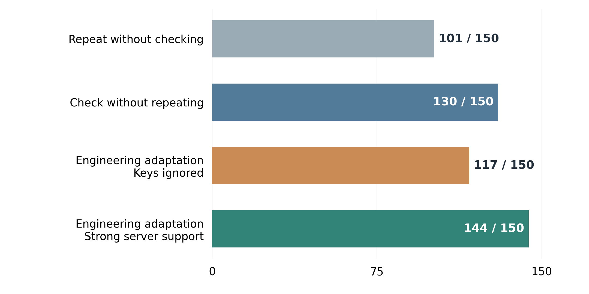
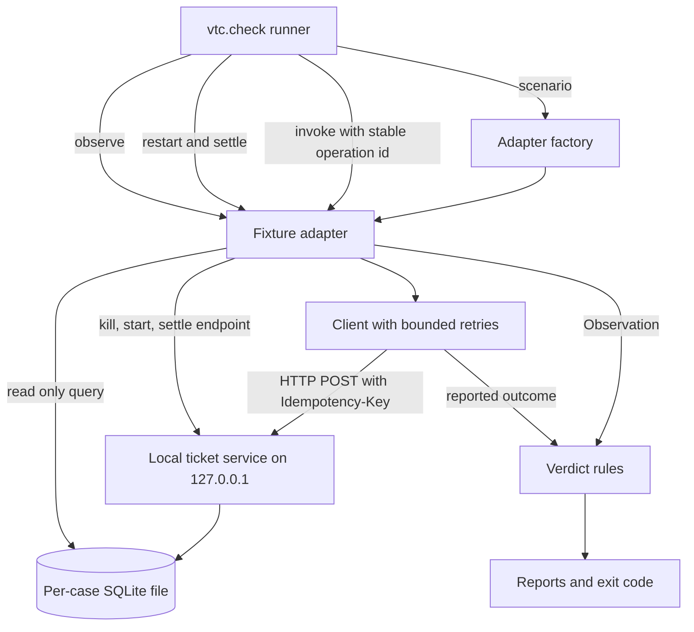
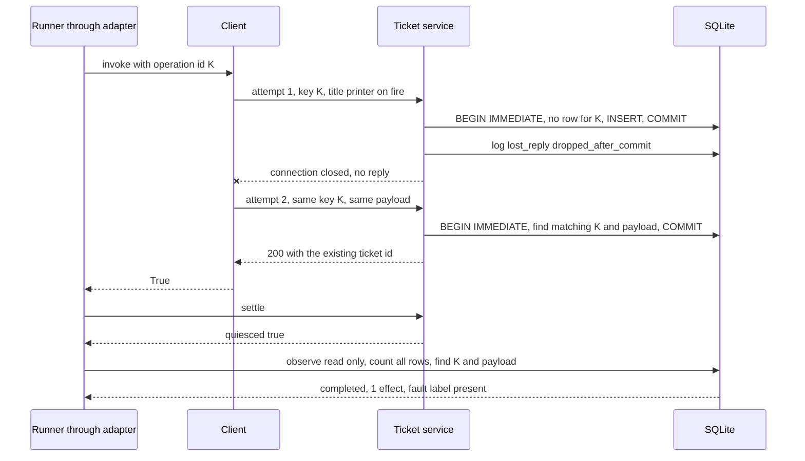
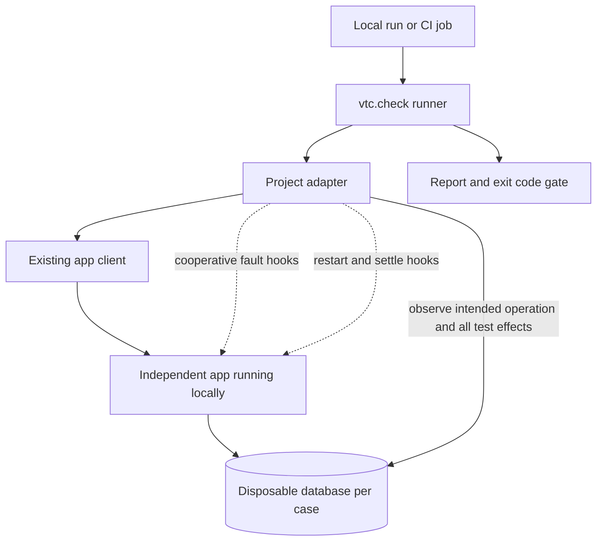

# How I Built a Python Tool to Catch Duplicate Writes During API Retries

*A local test you can run before changing a client’s retries, timeouts, or database write path*

You add retries so a dropped connection will not interrupt a job. But a missing response leaves the client with a problem it cannot solve from the error alone. Did the server reject the request, or did it save the record and lose the reply? Sending the request again can recover unfinished work. It can also create a second copy of work that already finished.

I built `vtc.check` to make that uncertainty testable. It runs a client against a local ticket service, deliberately drops replies and delays writes, then checks the database after the work has settled. You get a report showing whether the client saw success, whether the intended ticket exists, and whether the retry left an extra record. The bundled service has two versions, so you can run the same checks against a broken write path and one that handles retries safely within its database transaction.

The starting point was [Verified Tool Calls Improve LLM Agent Reliability Under Non-Atomic Failures, arXiv 2608.02645v1](https://arxiv.org/abs/2608.02645v1) (Mansoor et al., 2026). I built a proof of concept based on the paper, then extended the project with this HTTP and SQLite checker. Both are available in [Verified Tool Calls Lab](https://github.com/gael55x/verified-tool-calls-lab) (Amolong, 2026).

You can run the bundled example now or bring a client that follows its ticket protocol. Testing a different application takes an adapter, which I explain later. First, let’s run the tool and see what its report is asking us to fix.

## 1. Run the same client against two write paths

The checker uses only the standard library and needs Python 3.10 or later on Linux or macOS. From a fresh clone, create a parent folder for reports, then run the broken profile and the durable one. Each `--out` names a new directory inside a folder that already exists, so a rerun never overwrites earlier evidence.

```sh
git clone https://github.com/gael55x/verified-tool-calls-lab
cd verified-tool-calls-lab
mkdir -p repro-output
python3 -m vtc.check --profile broken --out repro-output/retry-broken
echo $?    # 1, four violations
python3 -m vtc.check --profile durable --out repro-output/retry-durable
echo $?    # 0, five passes
```

The broken run should exit 1 and the durable run should exit 0. Each run prints a scenario summary and writes JSON and Markdown reports. For every scenario, the reports show what the client reported, whether the exact operation completed, how many effects were stored and which fault labels the service recorded. A suggested fix in a report is a starting point for investigation, not an automatic repair.

### Why I wanted to test the server directly

Before the checker, I built a simulator that tracked three things separately for every action, its effect, its response and the record a later read would see. A write could therefore succeed while its reply timed out, or a read could return stale data. Scripted policies ran 1,200 main cases and 960 stress cases with matched faults across two three-stage jobs. No language model was involved.



*Figure 1. Correct final records out of 150 scripted cases per approach. The engineering adaptation reaches 144 with strong server support for stage receipts and pending reservations, versus 117 when keys are ignored. It differs from the paper-literal policy, which reaches 130 with support and is not plotted here. Each bar reuses 25 seed streams across two tasks and three fault levels. Longer bars are better. A case counts only when the complete job has no extra copy after delayed work settles. These are simulator outcomes, not live failure rates.*

Retrying blindly finished 101 cases correctly and verifying without retrying finished 130. The engineering adaptation checks full task completion and changes the paper's retry control flow. It reached 144 when the simulated service remembered completed stages and reserved jobs still in progress. Against a service that ignored the key, it reached only 117, below verification alone, because recovery attempts created extra records. A recovery policy depends on the server contract beneath it, so the checker tests that contract directly. Stress cases where a check saw one correct record before an older request added a second illustrate the race the paper already acknowledges.

## 2. Give each part of the checker one job

The paper separates three events that an application can easily confuse. Work takes effect, a response arrives, and a caller decides whether the work succeeded. Its proposed state checks help an agent recover, although delayed writes can still land after a check. My original simulator explored that question with scripted policies. The HTTP checker turns it into a practical test of a client and a service, with no language model involved.

The checker divides responsibility so that each part can be replaced without touching the others.

- The runner owns the scenario. It starts a fresh service and database for each case, holds one operation ID fixed for the whole case and decides the verdict.
- The client owns retries. One call from the runner can become several HTTP requests, up to three in the bundled example.
- The service owns the write and the injected fault, and it records a label whenever a fault fires.
- The observer reports what was actually stored instead of trusting the client.



*Figure 2. The current vtc.check architecture as implemented. The runner owns the scenario and the operation ID, the client owns its retries, and the verdict compares the final database state with what the client reported.*


The adapter is the boundary between the generic runner and one specific system, and it expresses those jobs as four methods. `invoke(operation_id)` makes one logical call through the client and returns True only if the caller saw success. `restart()` kills the service and starts it again on the same storage. `settle()` releases held work, waits until nothing is in flight and returns True only once the service is quiet. `observe(operation_id)` reports completion, the effect count and the recorded fault labels.

This split lets the runner compare the client’s answer with a separate observation. In the bundled fixture, that observation comes from a direct database read. An application adapter must provide equally trustworthy evidence. The fixture server also runs with inherited tokens and proxy settings stripped from its environment. Deadlines and process cleanup are covered in the [adapter contract](https://github.com/gael55x/verified-tool-calls-lab/blob/main/docs/RETRY_CHECK.md).

## 3. Follow a ticket through the reply that never arrives



*Figure 3. The lost reply scenario against the durable profile. The first commit stands even though the connection closes, and the retry replays the stored ticket instead of inserting a second one.*


In this scenario the client sends a create request carrying an operation key and a ticket body. The service commits the row, writes `lost_reply:dropped_after_commit` to an audit table and closes the connection without answering. To the client the request failed, so it retries with the same key and the same body. What happens next depends on how the service handles the second request.

The durable profile's writer in `vtc/http_example.py` makes that decision inside one SQLite transaction. This excerpt comes from the running fixture and is not a standalone server.

```python
def _write_durable(conn, key, payload):
    conn.execute("BEGIN IMMEDIATE")
    try:
        row = conn.execute("SELECT id, payload FROM tickets WHERE op_key = ?", (key,)).fetchone()
        if row is None:
            ticket = conn.execute("INSERT INTO tickets (op_key, payload) VALUES (?, ?)", (key, payload)).lastrowid
            result = 201, {"id": ticket}
        elif row[1] == payload:
            result = 200, {"id": row[0]}
        else:
            result = 422, {"error": "idempotency key reused with a different payload"}
        conn.execute("COMMIT")
    except BaseException:
        if conn.in_transaction:
            conn.execute("ROLLBACK")
        raise
    return result
```

`BEGIN IMMEDIATE` takes the write lock before the lookup, so the key check and the insert share one transaction and two overlapping requests cannot both find no row. A new key inserts and returns 201. A repeated key with the same payload returns 200 with the stored id, which is what the retry after a lost reply receives. A repeated key with a different payload returns 422 instead of quietly accepting what is probably a client bug. Every outcome commits, any exception rolls back and re-raises, and a UNIQUE constraint on `op_key`, defined elsewhere in the schema, backs the check in the database itself. The client must keep both the key and the payload stable across attempts, since the key identifies the job and the payload comparison confirms the retry is the same job.

The broken profile shows a design that looks reasonable and fails here. It inserts on every request and remembers replies in an in-memory dictionary, but only after a reply has been written to the socket. When the reply is lost nothing is cached, so the retry finds no entry and inserts a second ticket. The same cache disappears on restart and does nothing for overlapping requests or a first write that lands late. If your handler relies only on a reply cache filled after sending, this is the gap to look for.

## 4. Check the database after the retries have finished

Inspecting the database the moment the client returns would miss the hardest case. In the late commit scenario, the service holds the first write until a retry has committed and then releases it. An early inspection would see one correct ticket that later becomes two. The runner therefore calls settle after the client returns and observes only when settle confirms that nothing is in flight. Two more scenarios stress the same write path. Concurrent overlaps two invocations of the operation. Restart kills the service, starts it on the same database and invokes the same ID again.

The observer opens the database read only and asks two separate questions. Completion means a row exists with the exact operation ID and the exact expected payload. The effect count covers every row in that case's database, not only rows carrying the expected key. Each case has a disposable database, so counting everything is safe and useful. A client that generates a fresh key on each attempt would otherwise leave two rows that each look like an unrelated success. The full count exposes them as one logical operation applied twice.

That comparison produces three possible verdicts. A **pass** means every invocation reported success, the exact operation finished once, and the required fault labels show the test actually ran. A **violation** means duplicate work or a success response for an operation that never completed. **Inconclusive** means the checker could not establish the result, perhaps because work never settled, a fault did not fire, or the client still reported failure.

These distinctions matter when you use the exit code in a script. Exit 0 means every scenario passed. Exit 1 means at least one violation was observed and you should investigate the report. Exit 2 covers invalid input, an inconclusive run without an observed violation, or a harness crash. An inconclusive verdict needs investigation of the client, setup and hooks; it is not evidence that the write path is safe. The [adapter contract](https://github.com/gael55x/verified-tool-calls-lab/blob/main/docs/RETRY_CHECK.md) documents the full rule ordering and observation checks.

## 5. What changed when the database protected the operation

| Scenario | Broken effects | Durable effects | Expected |
|---|---|---|---|
| Clean control | 1 | 1 | 1 |
| Reply lost after commit | 2 | 1 | 1 |
| First write commits late | 2 | 1 | 1 |
| Concurrent attempts | 2 | 1 | 1 |
| Process killed and restarted | 2 | 1 | 1 |

Both profiles pass the clean control, so the fixture and client behave when nothing goes wrong. Under the same four faults and the same client, the broken profile stores two tickets each time while the durable profile keeps one and passes all five scenarios. These are deliberately seeded failures that show the checker can tell the two designs apart. They are not bugs discovered in another application, and they say nothing about how often such failures happen in production.

A [fresh reader replay](https://github.com/gael55x/verified-tool-calls-lab/tree/main/evidence/reader-replay-20261002) reruns both profiles against the final implementation and retains source hashes. Continuous integration runs 53 tests on Python 3.10 and 3.12, including both quickstarts. The [results summary](https://github.com/gael55x/verified-tool-calls-lab/blob/main/docs/RETRY_RESULTS.md) explains each retained artifact and where it came from.

## 6. Bring the same checks to your own project

The useful moment is before a change touches retries, such as raising an SDK's retry count, switching HTTP libraries, shortening a timeout or moving an insert behind a queue. The five default scenarios can gate changes to the fixture or to a custom client that speaks its protocol. Gating your own application requires an adapter, and Figure 4 shows the shape I propose. It is a design, not shipped code.



*Figure 4. How a project-specific adapter would connect the checker to a local application and its test database.*


Two flags change what is under test. `--client MODULE:FUNCTION` replaces the bundled client while keeping the same fixture, which is the quickest way to exercise a retry wrapper you wrote. That client must speak the fixture's ticket protocol, including its fixed title `printer on fire`, which is a test payload rather than a requirement for your application. `--adapter MODULE:FACTORY` connects a different service, but only through project-specific hooks you supply. The checker does not take a URL and probe an arbitrary application, and no adapter for an independent application ships with it. Both kinds of module run as trusted local code without a sandbox.

The hooks must be cooperative. The checker cannot reach into an arbitrary process to drop a reply after commit or hold a write. Your application therefore needs test-only switches for those faults, a restart against the same disposable database and a settle signal that truthfully reports when in-flight work is done. The checker trusts the observations and labels the adapter returns, so an optimistic adapter produces optimistic verdicts.

This order keeps findings trustworthy.

1. Review the create handler. Confirm that lookup and insert share one transaction, a unique constraint backs the key, a reused key with a different payload is rejected, and the client keeps the same key and body on every attempt.
2. Write the adapter's acceptance test and capture the unchanged baseline.
3. Treat a violation as a candidate until you trace it in the code and reproduce it independently.
4. If the baseline passes, apply a clearly labeled mutation to confirm the checker detects failure, and keep seeded failures apart from genuine findings.
5. Make the smallest change that passes, then refactor with the check still green.

The durable pattern protects one transactional database write. If creating a record also sends an email, charges a card or calls another service, the key protects the row and nothing beyond it. A pass means no duplicate or lost effect appeared in five deterministic scenarios, not that the system is exactly-once. The [related tools](https://github.com/gael55x/verified-tool-calls-lab/blob/main/docs/RELATED_TOOLS.md) page lists alternatives worth comparing.

## 7. Conclusion and how this helps you

`vtc.check` lets you watch a write path survive or fail a lost reply using a real HTTP client and a real SQLite file rather than a mock. The durable writer shows a pattern worth copying. It keeps lookup and insert in one transaction, puts a unique constraint on the operation key and compares stable payloads. The broken reply cache shows a pattern worth searching for in your own code.

Start by running both profiles from a fresh clone and confirming that the broken one exits 1 and the durable one exits 0. Point `--client` at your retry wrapper to see how it behaves against the fixture. Then review your own create handler with the checklist above. When you are ready to test the application itself, build the cooperative adapter that Figure 4 describes.

## References

Amolong, G. (2026). *Verified tool calls lab* (Version d564e13) [Computer software]. GitHub. [https://github.com/gael55x/verified-tool-calls-lab/tree/d564e13887d239e1d60b7fa60586e795d821ebe7](https://github.com/gael55x/verified-tool-calls-lab/tree/d564e13887d239e1d60b7fa60586e795d821ebe7)

Mansoor, I. K., Phadke, A., & Rana, P. (2026). *Verified tool calls improve LLM agent reliability under non-atomic failures* [Preprint]. arXiv. [https://doi.org/10.48550/arXiv.2608.02645](https://doi.org/10.48550/arXiv.2608.02645)
